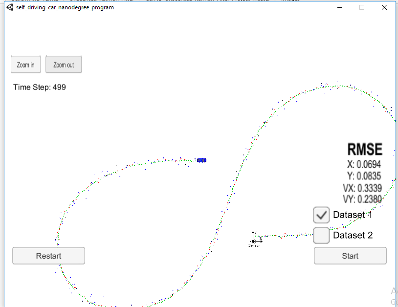
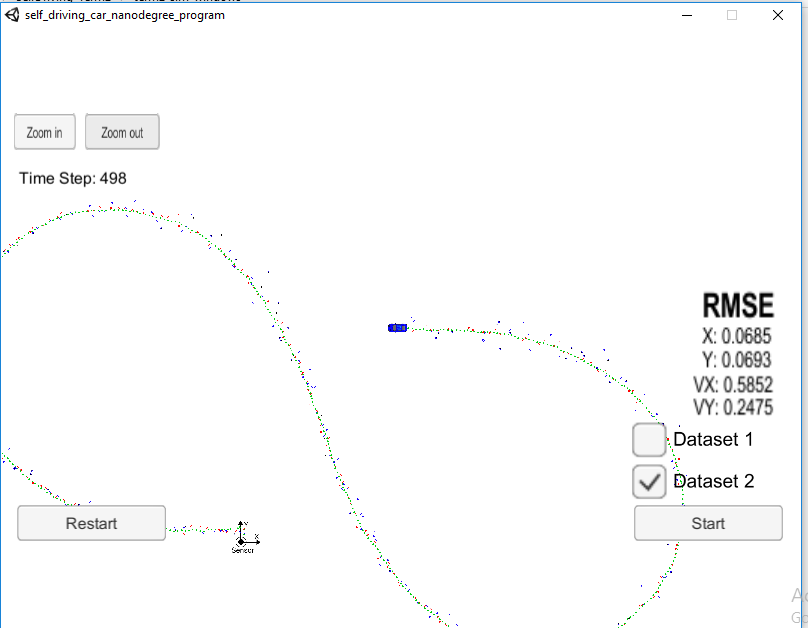

# Unscented Kalman Filter Project
Self-Driving Car Engineer Nanodegree Program

In this project utilize an Unscented Kalman Filter to estimate the state of a moving object of interest with noisy lidar and radar measurements. Passing the project requires obtaining RMSE values that are lower that the tolerance outlined in the project rubric. 

This project involves the Term 2 Simulator which can be downloaded [here](https://github.com/udacity/self-driving-car-sim/releases)

This repository includes two files that can be used to set up and intall [uWebSocketIO](https://github.com/uWebSockets/uWebSockets) for either Linux or Mac systems. For windows you can use either Docker, VMware, or even [Windows 10 Bash on Ubuntu](https://www.howtogeek.com/249966/how-to-install-and-use-the-linux-bash-shell-on-windows-10/) to install uWebSocketIO. Please see [this concept in the classroom](https://classroom.udacity.com/nanodegrees/nd013/parts/40f38239-66b6-46ec-ae68-03afd8a601c8/modules/0949fca6-b379-42af-a919-ee50aa304e6a/lessons/f758c44c-5e40-4e01-93b5-1a82aa4e044f/concepts/16cf4a78-4fc7-49e1-8621-3450ca938b77) for the required version and installation scripts.

Once the install for uWebSocketIO is complete, the main program can be built and ran by doing the following from the project top directory.

1. mkdir build
2. cd build
3. cmake ..
4. make
5. ./UnscentedKF

Tips for setting up your environment can be found [here](https://classroom.udacity.com/nanodegrees/nd013/parts/40f38239-66b6-46ec-ae68-03afd8a601c8/modules/0949fca6-b379-42af-a919-ee50aa304e6a/lessons/f758c44c-5e40-4e01-93b5-1a82aa4e044f/concepts/23d376c7-0195-4276-bdf0-e02f1f3c665d)

Note that the programs that need to be written to accomplish the project are src/ukf.cpp, src/ukf.h, tools.cpp, and tools.h

The program main.cpp has already been filled out, but feel free to modify it.

Here is the main protcol that main.cpp uses for uWebSocketIO in communicating with the simulator.


INPUT: values provided by the simulator to the c++ program

["sensor_measurement"] => the measurment that the simulator observed (either lidar or radar)


OUTPUT: values provided by the c++ program to the simulator

["estimate_x"] <= kalman filter estimated position x
["estimate_y"] <= kalman filter estimated position y
["rmse_x"]
["rmse_y"]
["rmse_vx"]
["rmse_vy"]

---

## Other Important Dependencies
* cmake >= 3.5
  * All OSes: [click here for installation instructions](https://cmake.org/install/)
* make >= 4.1 (Linux, Mac), 3.81 (Windows)
  * Linux: make is installed by default on most Linux distros
  * Mac: [install Xcode command line tools to get make](https://developer.apple.com/xcode/features/)
  * Windows: [Click here for installation instructions](http://gnuwin32.sourceforge.net/packages/make.htm)
* gcc/g++ >= 5.4
  * Linux: gcc / g++ is installed by default on most Linux distros
  * Mac: same deal as make - [install Xcode command line tools](https://developer.apple.com/xcode/features/)
  * Windows: recommend using [MinGW](http://www.mingw.org/)

## Basic Build Instructions

1. Clone this repo.
2. Make a build directory: `mkdir build && cd build`
3. Compile: `cmake .. && make`
4. Run it: `./UnscentedKF` Previous versions use i/o from text files.  The current state uses i/o
from the simulator.


## Running the Filter

From the build directory, execute `./UnscentedKF`. The output should be:

```
Listening to port 4567
Connected!!!
```

As you can see, the simulator connect to it right away.

The simulator provides two datasets. The differences between them are:

- The direction the car (the object) is moving.
- The order the first measurement is sent to the UKF. On dataset 1, the LIDAR measurement is sent first. On the dataset 2, the RADAR measurement is sent first.

Here is the simulator final state after running the EKL with dataset 1:



Here is the simulator final state after running the EKL with dataset 2:



# [Rubric](https://review.udacity.com/#!/rubrics/783/view) points

## Compiling

### Your code should compile.

No modifications on CMakeList.txt were done in this project. It compiles without errors or warnings.

## Accuracy

### Your algorithm will be run against "obj_pose-laser-radar-synthetic-input.txt". We'll collect the positions that your algorithm outputs and compare them to ground truth data. Your px, py, vx, and vy RMSE should be less than or equal to the values [.09, .10, .40, .30].
The UKF accuracy was:

- Dataset 1 : RMSE = [0.0694, 0.0835, 0.3339, 0.2380]
- Dataset 2 : RMSE = [0.0685, 0.0693, 0.5852, 0.2475]

## Following the Correct Algorithm

### Your Sensor Fusion algorithm follows the general processing flow as taught in the preceding lessons.

The UKF implementation could be found at [src/ukf.cpp](./src/ukf.cpp). On the [ProcessMeasurement](./src/ukf.cpp#) method, the [Prediction](./src/ukf.cpp) is executed for the prediction step, and methods [UpdateRadar](./src/ukf.cpp) and [UpdateLidar](./src/ukf.cpp) are executed for the update step depending on the measurement type.

### Your Kalman Filter algorithm handles the first measurements appropriately.

The first measurement is handled at [ProcessMeasurement](src/ukf.cpp)

### Your Kalman Filter algorithm first predicts then updates.

The prediction step is implemented at [Prediction](./src/ukf.cpp) method
### Your Kalman Filter can handle radar and lidar measurements.

Different type of measurements are handled in two places in [UKF class](src/ukf.cpp):

- For the first measurement.
- For the update step.

